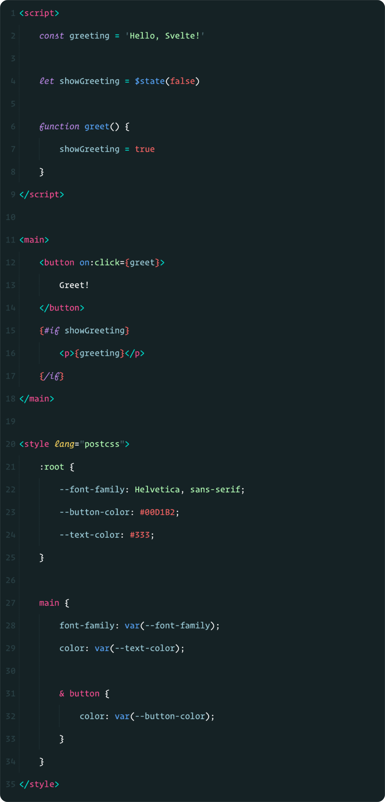

# Svelte Syntax Highlighting

Sublime Text Syntax highlighting for [Svelte 3](https://svelte.dev/) components.

### Install

- Via Package Control: search for `Svelte`.
- Manual: clone this repo into your Sublime `Packages` folder.

**NOTE:** You still need to install corresponding packages for pre-processors (e.g. SASS, Typescript) to get proper syntax highlighting for them.

### Special Thanks

Huge thanks to the Vue.js folks for their [Vue Syntax Highlight](https://github.com/vuejs/vue-syntax-highlight/) package from which a *ton* of solutions for this package came.

And, obviously, the biggest thanks to Rich Harris for making something as awesome as [Svelte](https://svelte.dev/).

### License

[MIT](http://opensource.org/licenses/MIT)
