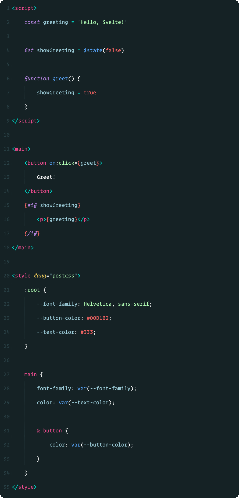

# Svelte Syntax Highlighting

Sublime Text syntax highlighting for [Svelte](https://svelte.dev/) components, reactive JavaScript and TypeScript modules, and MDSVEX documents.



### Install

- Via Package Control: search for `Svelte`.
- Manual: clone this repo into a folder named `Svelte` inside your Sublime `Packages` folder. Use **Preferences → Browse Packages** to find it.

Requires Sublime Text 4, build 4143 or newer. CI tests builds 4143, 4152, 4169, 4180, and the latest development build.

### Supported files and features

| Files | Syntax in the picker |
| --- | --- |
| `.svelte` | Svelte |
| `.svelte.js` | JavaScript (Svelte) |
| `.svelte.ts` | TypeScript (Svelte) |
| `.svx`, `.mdsv`, `.mdsvex` | MDSVEX |

Svelte highlighting includes runes, TypeScript template expressions, script `generics`, snippets, render and attachment tags, declaration tags, event attributes, comments between attributes, member components, boundaries, and markup `await`. Legacy blocks and directives remain supported.

MDSVEX combines Markdown with Svelte components and expressions, including expressions in link and image destinations. For projects configured to use `.md` files, select **MDSVEX** manually or use **Open all with current extension as…** in the syntax menu.

This package provides syntax highlighting. For diagnostics, navigation, and language-server completions, install [LSP](https://packagecontrol.io/packages/LSP) and [LSP-svelte](https://packagecontrol.io/packages/LSP-svelte) separately.

---

### Supported Scripts

##### TypeScript

```html
<script lang="typescript"></script>
<!-- or -->
<script type="text/typescript"></script>
```

or

```html
<script lang="ts"></script>
```

`type="application/typescript"` is also supported. Use `lang="ts"` for the short language name; `type="text/ts"` is not recognized.

##### CoffeeScript

```html
<script lang="coffeescript"></script>
<!-- or -->
<script type="text/coffeescript"></script>
```

##### LiveScript

```html
<script lang="livescript"></script>
<!-- or -->
<script type="text/livescript"></script>
```

##### Babel

```html
<script lang="babel"></script>
<!-- or -->
<script type="text/babel"></script>
```

### Supported Styles

##### Sass

```html
<style lang="sass"></style>
<!-- or -->
<style type="text/sass"></style>
```

##### Sass (SCSS)

```html
<style lang="scss"></style>
<!-- or -->
<style type="text/scss"></style>
```

##### Less

```html
<style lang="less"></style>
<!-- or -->
<style type="text/less"></style>
```

##### Stylus

```html
<style lang="stylus"></style>
<!-- or -->
<style type="text/stylus"></style>
```

##### PostCSS

```html
<style lang="postcss"></style>
<!-- or -->
<style type="text/postcss"></style>
```

JavaScript, TypeScript, and CSS use Sublime Text's bundled syntaxes. Install the corresponding syntax packages for other languages, such as [Sass](https://packagecontrol.io/packages/Sass) and [Less](https://packagecontrol.io/packages/Less). This package does not install or run preprocessors.

### Testing

Tests in `tests/` assert the scopes assigned by Sublime Text's syntax engine. To run them locally:

1. Install this checkout as `Packages/Svelte` and install the syntax dependencies for the embedded languages used by the tests.
2. Open a `syntax_test_*` file or a `.sublime-syntax` file from this package.
3. Choose **Tools → Build System → Syntax Tests**, then **Tools → Build**. Use **Tools → Build Results → Next Result** to navigate failures.

See [Sublime's syntax testing documentation](https://www.sublimetext.com/docs/syntax.html#testing) for assertion syntax. Native tests use the installed Sublime build and packages; Docker is not required.

[CI](https://github.com/corneliusio/svelte-sublime/actions/workflows/ci-syntax-tests.yml) runs the full five-build matrix on syntax or test changes, every Monday at 07:23 UTC, and through **Run workflow** in GitHub Actions. Historical jobs pin default packages, Less, and Sass to compatible refs; the latest job tracks their upstream branches. CI supplies empty syntaxes for CoffeeScript, LiveScript, PostCSS, SugarSS, and Stylus, so it checks embedding boundaries without validating those languages' internal highlighting. Use the [workflow configuration](.github/workflows/ci-syntax-tests.yml) when reproducing a particular CI environment.

### Known limitations

The lookahead that distinguishes TypeScript assertions from the `as` in an `each` block supports three levels of bracket nesting. It does not skip string literals or see a later `as` on another line. Keep chained assertions and the loop's `as` on one line, or parenthesize the source assertion, for example `{#each (items as Item[]) as item}`.

---

### Special Thanks

Huge thanks to the Vue.js folks for their [Vue Syntax Highlight](https://github.com/vuejs/vue-syntax-highlight/) package from which a _ton_ of solutions for this package came.

And, obviously, the biggest thanks to Rich Harris for making something as awesome as [Svelte](https://svelte.dev/).

### License

[MIT](http://opensource.org/licenses/MIT)
